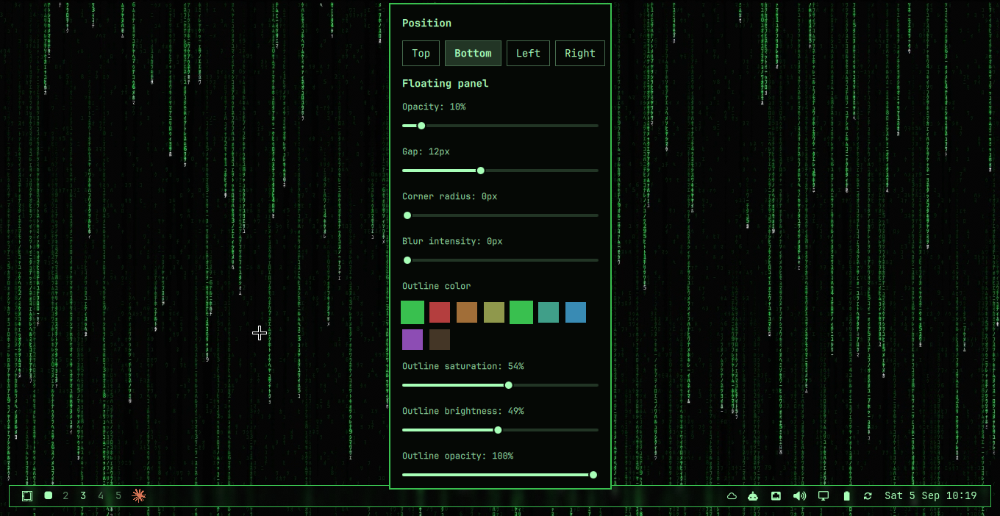

# omarchy-plasma-toolbar-clone

A Quickshell Omarchy bar, customized to feel like the KDE Plasma taskbar:
a floating panel with adjustable position, opacity, blur, and outline
color, plus a pinned-app launcher for one-click app shortcuts. The one
thing this deliberately does **not** clone is Plasma's own application
launcher/start menu — that's still Omarchy's stock app menu
(`omarchy.menu`), left alone on purpose rather than replaced.



Built by iterating with Claude Code on top of `omarchy.bar` (this repo
started as a clone of the stock bar — see `manifest.json`'s `clonedFrom`).
What's added on top of stock:

- **Position selector** — Top/Bottom/Left/Right buttons in the settings
  popup (right-click the bar), on top of the stock drag-to-edge move.
- **Floating panel opacity that actually reaches 0** — the stock slider
  bottomed out at 10%; here it (and the loader) go all the way to fully
  transparent.
- **Outline color, decoupled from the fill** — hue/saturation/brightness/
  opacity for the panel's border are independent of the fill's opacity, so
  you can have an invisible fill with a visible outline, or vice versa.
  Until you pick a swatch, the outline tracks your theme's `accent` color
  live — the same `colors.toml` key Hyprland's own window border uses — so
  it matches your actual window borders and updates automatically on
  `omarchy theme set`. Picking a swatch pins it to that color instead
  (persisted, survives restarts); there's currently no UI to go back to
  "follow the theme" short of deleting `floating-settings.json`'s
  `borderCustomized`/`borderHue`/`borderSaturation`/`borderLightness` keys.
- **Outline color swatches pulled from the active theme** — no arbitrary
  hue wheel; the presets are your theme's own `colors.toml` palette
  (accent/red/orange/yellow/green/cyan/blue/magenta/brown), so switching
  Omarchy themes gives you matching presets automatically.
- **Blur slider works on both stock and Lua-config Hyprland forks** — sends
  both the standard `hyprctl keyword decoration:blur:size` and this
  project's dev machine's `hyprctl eval hl.config(...)` form every time;
  each compositor ignores the one it doesn't understand.
- **Pinned-app launcher widget** (`widgets/PinnedApp.qml`) — a one-click
  bar icon for a fixed command or an installed app, the Plasma-taskbar-
  pinned-icon pattern. This machine's example pins the default coding
  agent (`omarchy-agent`) with the Claude logo.

See `shell.json.example` for this machine's actual layout (bottom
position, the pinned agent icon, icon order) to use as a starting point.

## Stock bar documentation

The rest of this file is the documentation for the underlying stock
`omarchy.bar` engine this was cloned from — still accurate, since none of
the above changes it fundamentally.

This is the Quickshell implementation of the Omarchy status bar. It is
shipped as a first-party plugin of [`omarchy-shell`](../../README.md), the
long-running shell host. The bar is mounted at startup and lives inside
the shell for its whole session.

- `manifest.json` declares the plugin (`id: omarchy.bar`, `kind: bar`) and points at `Bar.qml` as the entry point.
- `Bar.qml` is Omarchy-owned bar engine code, loaded by the omarchy-shell host. Users should not edit it directly.
- `widgets/` holds simple first-party bar widgets with sibling manifests.
- Feature plugins such as `../panels/audio/`, `../panels/network/`, `../panels/power/`, and `../agents/` provide richer popup bar plugins.
- The bar receives its config from the host shell as a `barConfig` property; the host loads it from `~/.config/omarchy/shell.json` (or `config/omarchy/shell.json` when the user has no file).
- `omarchy bar position` updates only the user shell.json file.

## Customizing

The bar config lives under the `bar:` key of [`~/.config/omarchy/shell.json`](../../README.md#shelljson-shape). Out of the box the shell uses [`config/omarchy/shell.json`](../../../config/omarchy/shell.json). Once you customize anything via the bar gestures, `omarchy bar ...`, or by editing shell.json directly, your file is canonical — there is no deep-merge.

The bar is configured directly on the bar itself: drag empty bar space (or click-and-hold) to move the bar to another screen edge, double-left-click empty center-bar space to toggle transparency, and drag widgets to reorder them. The `omarchy bar position`, `omarchy bar transparent`, `omarchy bar move`, and `omarchy bar set` commands do the same from scripts. Enable or disable widgets with `omarchy plugin enable` and `omarchy plugin disable` (widget ids come from `omarchy plugin list`).

Example `shell.json` (bar subtree only shown):

```json
{
  "version": 1,
  "bar": {
    "position": "top",
    "transparent": false,
    "centerAnchor": "omarchy.clock",
    "layout": {
      "left": [
        { "id": "omarchy.menu" },
        { "id": "omarchy.spacer", "size": 12 },
        { "id": "omarchy.workspaces" }
      ],
      "center": [
        { "id": "omarchy.media" },
        { "id": "omarchy.clock", "format": "HH:mm" }
      ],
      "right": [
        { "id": "omarchy.audio" },
        { "id": "omarchy.power" }
      ]
    }
  }
}
```

`centerAnchor` pins one center module to the exact horizontal/vertical center and flanks others around it. Set to an empty string to disable anchoring (the center list is centered as a group).

## Module catalogue

### First-party interactive widgets

| Name | What it does | Interactions |
|---|---|---|
| `omarchy.menu` | Omarchy menu launcher | left = menu · right = terminal |
| `omarchy.workspaces` | Hyprland workspace switcher | left = focus workspace |
| `omarchy.clock` | Date/time label + popup with a month grid, ISO week numbers, and month stepping | left = popup · right = cycle label format · middle = timezone selector |
| `omarchy.media` | MPRIS now-playing — scrolling track + artist, cover-art popup | left = play/pause · middle = next · scroll = prev/next · right = popup |
| `omarchy.indicators` | Manual state indicators | left = indicator action |
| `omarchy.system-update` | Available update indicator | left = update |
| `omarchy.tray` | System tray | hover = reveal drawer · right on chevron = manage |
| `omarchy.weather` | Weather icon + popup with forecast | left = popup · right = full notification |
| `omarchy.microphone` | Mic icon + scroll volume | left = mute toggle · middle = audio panel · scroll = source volume |

| `omarchy.audio` | Volume icon + popup with master slider, output-device picker, per-app mixer | left = popup · right = mute · middle = popup · scroll = volume |
| `omarchy.network` | Wi-Fi/Ethernet icon + popup with Wi-Fi scan, signal, connect, DNS provider selection | left = popup |
| `omarchy.tailscale` | Tailscale status, connection switcher, machine browser, and copy actions | left = popup · right = toggle · middle = refresh |
| `omarchy.agents` | AI coding agent limits with pace, today, last week, and all-time model breakdown | left = panel · right = launch agent · middle = next subscription |
| `omarchy.power` | Battery/AC icon + popup with battery stats, power profiles, and system info | left = popup · right = toggle percentage |
| `omarchy.bluetooth` | Bluetooth icon + popup with device list, connect/disconnect, battery | left = popup · right = toggle radio |
| `omarchy.monitor` | Brightness and laptop display controls | left = popup |

The `omarchy.indicators` widget loads individual bar indicators from `indicators/`. Omit `items` (or set it to an empty array) to show all indicators in the default order, or set `items` to a subset such as `["Dnd", "Reminder", "NightLight"]`. Set `alwaysShow` to `true` to keep inactive indicators visible instead of revealing them only on hover. Multiple `omarchy.indicators` instances are allowed, so different sections can show different subsets.

## Orientation

All widgets work in `top`, `bottom`, `left`, and `right` positions. Popups anchor on the side opposite the bar edge, sliding into the workspace. Vertical bars use 28px width; widgets that show text fall back to compact icon-only forms (e.g. `media` hides its scrolling label).

## Custom user modules

The schema accepts arbitrary module ids that you provide. Set `type` to `command` for shell-driven output or `qml` for a custom QML widget. Both still go under `bar.layout.<section>` in `shell.json`.

Command module:

```json
{
  "version": 1,
  "bar": {
    "layout": {
      "right": [
        { "id": "omarchy.tray" },
        { "id": "vpn", "type": "command", "exec": "~/.config/omarchy/bar/scripts/vpn-status", "interval": 5, "tooltip": "VPN", "onClick": "nm-connection-editor" },
        { "id": "omarchy.audio" }
      ]
    }
  }
}
```

The command may print plain text or Waybar-style JSON, for example:

```json
{"text":"󰌆","tooltip":"Work VPN","class":"active"}
```

QML module:

```json
{
  "version": 1,
  "bar": {
    "layout": {
      "right": [
        { "id": "gpu", "type": "qml" },
        { "id": "omarchy.audio" }
      ]
    }
  }
}
```

Then create `~/.config/omarchy/bar/modules/gpu.qml`. If you want to store it elsewhere, add a `source` path.

Custom QML modules should be an `Item` with `implicitWidth` and `implicitHeight`. They may optionally define these properties, which the bar fills after loading:

```qml
import QtQuick

Item {
  property var bar
  property string moduleName
  property var settings

  implicitWidth: 28
  implicitHeight: bar ? bar.barSize : 26

  Text {
    anchors.centerIn: parent
    text: "GPU"
    color: bar ? bar.foreground : "white"
    font.family: bar ? bar.fontFamily : "monospace"
    font.pixelSize: 12
  }

  MouseArea {
    anchors.fill: parent
    onClicked: if (bar) bar.run("omarchy-launch-or-focus-tui btop")
  }
}
```

## Bar properties available to widgets

Widgets receive `bar` (the shell root), `moduleName` (string), and `settings` (object) injected at load time. The bar exposes:

- `bar.foreground`, `bar.background`, `bar.urgent` — theme colors (live-updated)
- `bar.fontFamily` — current monospace family
- `bar.position` — `"top" | "bottom" | "left" | "right"`
- `bar.vertical` — boolean shortcut
- `bar.barSize` — 26 horizontal / 28 vertical
- `bar.run(command)` — fire-and-forget bash exec
- `bar.shellQuote(value)` — safe shell-quote a string
- `bar.showTooltip(target, text)` / `bar.hideTooltip(target)` — shared tooltip popup
- `bar.requestPopout(owner)` / `bar.releasePopout(owner)` — one-popup-at-a-time coordinator

First-party bar widgets are manifest-backed just like third-party widgets.
Simple widgets carry sibling manifests such as `widgets/Workspaces.manifest.json`;
richer popup plugins live in feature directories such as `../panels/audio/`,
`../panels/network/`, and `../agents/`; and feature plugins such as
`omarchy.menu` and `omarchy.media` declare their bar-widget entry points in their own
`manifest.json`. Bar layout ids are namespaced, e.g. `omarchy.audio`,
`omarchy.network`, and `omarchy.clock`. Older UpperCamelCase ids such as
`AudioPanel` and `Clock` are migrated forward; new configs should use the
namespaced ids.

Third-party widgets ship as separate plugins under
`~/.config/omarchy/plugins/<plugin-id>/` with their own `manifest.json`
declaring `kinds: ["bar-widget"]` and a `barWidget` entry point. See
[../../README.md](../../README.md) for the manifest schema. Rescan, enable,
and place third-party plugins with `omarchy-shell shell rescanPlugins`,
`omarchy plugin enable`, and `omarchy bar move`.

## This machine's layout

`shell.json.example` is a copy of this machine's actual
`~/.config/omarchy/shell.json` — position (bottom), the pinned agent
launcher, and the current left/center/right icon order. On a new machine,
after cloning this repo into `~/.config/omarchy/plugins/spencer.bar`, copy
its `bar` subtree into your own `~/.config/omarchy/shell.json` (or copy the
whole file if you don't have one yet) and `omarchy restart shell`.

Note the ad-hoc widget mechanism used for the pinned launcher: third-party
plugins only get their top-level `manifest.json` scanned (see
`PluginRegistry.qml`'s `scan_thirdparty`), so nested files under `widgets/`
in this repo — despite carrying sibling `*.manifest.json` files, a pattern
copied from the first-party bar this was cloned from — are never picked up
as registered bar-widgets. New widgets (like `widgets/PinnedApp.qml`) have
to be loaded per-instance from shell.json instead, via
`{ "type": "qml", "source": "~/.config/omarchy/plugins/spencer.bar/widgets/<File>.qml", ... }`.
